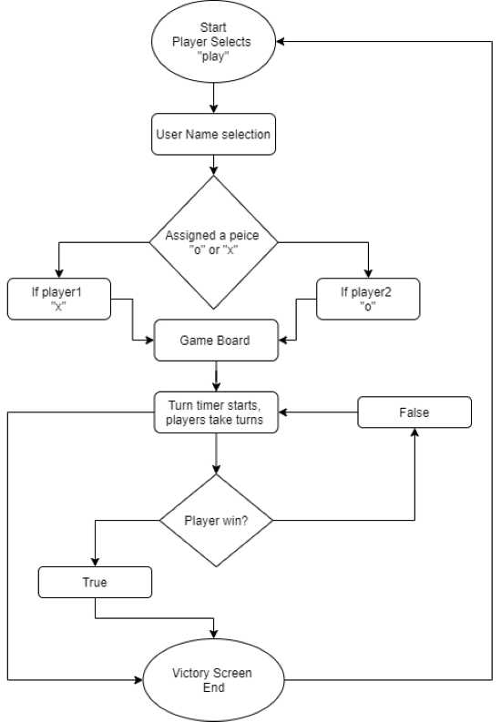
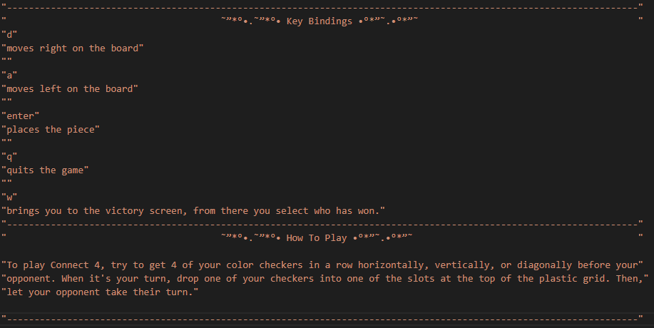

# ReadMe, Connect Four edition

### Statement of Purpose and Scope 

##### What the app does

Connect Four introduces the two characters with the main menu, for which they are able to create their player names. Once finished they are greeted with the vertical seven by six board and players are assigned a marker "x" and "o" respectively. Players take turns to put their pieces at the bottom of the board to attempt to connect 4 of their pieces in a horizontal, vertical, or diagonal line of four, this resulting in a win. The victorious player will have their name displayed and dubbed victorious. 

##### Problem it will solve 

Connect Four will attempt to solve boredom and possibly act as an icebreaker. Solving boredom through its intellectually challenging and entertaining nature, as both players must analyse the others move so as to not allow them to win. Acting as an icebreaker as organisations (e.g.. schools) could use with app as a way to introduce new people through Connect Fours co-op nature. 

##### Target Audience 

Connect Four is skewed towards a younger audience who wish to play a game with their friend to kill time.  This being especially relevant in todays circumstances, with video gaming being an increasingly poplar hobby amongst youths. With this digitised copy of Connect Four it attempts to appeal to that audience bringing back the once physical game enjoyed by many, in digital form.

##### How will target audience use this app? 

The younger target audience will play Connect Four with a friend, choosing each move carefully stimulating their mind while simultaneously having fun and socialising.  

### Features 

1. **Selection**    

   The selection feature will be an array which is displayed at the top of the board. There will be key bindings to cycle left and right through the array, this dictating where you will be placing your piece in the board. This feature will have to be in a loop as users must make multiple moves in game. There must also be limitations placed on how far the user can move through the array, limiting it to its maximum and minimum index.

   

2. **Piece placing**     

   The piece placing feature will place a players piece at the bottom of the board and stack if there is already one at the bottom. Building on the selection feature, the user will be ale to press "enter" to place their based on the index they selected with the selection feature. If the selected column is full and the user presses "enter" their turn will be reset, therefore handling a potential error.

   

3. **Menu selection**  

   The main menu will be the starting screen, from here a user will be able to select what they wish to do. The intended options on the menu will be "play" which will lead to the game, "tutorial" which will give the user a guide on the game and "quit" which will exit the program. This menu will be achieved utilizing the gem 'tty prompts', enabling the user to have an interactive experience.

Extras 

1. **Custom victory screen**   

   Based off which player wins there will be a different victory screen for both. The victory screen will contain ASCII art text using the gem 'artii', thus adding authenticity and a satisfaction to winning.  
   
   
   
2. **Automatic victory detection** 

   Based off users moves, the game will detect a victory. This will be divided into three variables, horizontal , vertical and diagonal victory. The game will constantly cycle thought the board array to see if anyone one of these conditions is met. If any of these conditions is met players will be taken to a victory screen.

### User Interaction and Experience 

**User story** 

1. user will be met by main menu with 3 options 
   1. Play 
      - user will be asked a name for both player 1 and player 2 
        - the game will load 
          -   players will take turns putting pieces 
            - when one recognises a win they will press "w" 
              - this will bring up a victory screen  where users will chose who won 
                - based off that input a victory art screen 
                  - players will be prompted back to main menu
   2. Tutorial  
      1. Will show user controls and brief over view of how to play the game 
         - prompted to go back to main menu 
   3. Exit 
      1. will exit the program 

**Error Handling**

Error handling instances include 

1. Place piecing limit 
   - once a user has reach the limit of pieces placed in column pressing "enter" to place the piece will simply just restart their turn. The program will reset the players turn moving their piece back to the centre of the board.  
2.  Selector limit
   - Once a user has moved the selector to its very limits by pressing either "a" or "d" it will simply stay at the limit, unless instructed in the opposite direction. The program will have an if statement attached to both the "a" and "d" controls, telling it that if it reaches its limit don't add anymore to the index, but rather renew its maximum value. The user will only see that the piece will not move past its limits, no error message will be given.  
3. name size limit 
   - If the user is not within the specified boundaries of character length the user will prompted with a error message, telling them that they had too many or too few characters  and to try again. 

### **Implementation Plan** 

**More detail on Trello:**https://trello.com/invite/b/J5UtRdlD/38d45612e910d523adb949c06649f940/connect-4-code

| Features                            | Checklist                                                    | Priority | Deadline      |
| ----------------------------------- | ------------------------------------------------------------ | -------- | ------------- |
| Key binding movement                | Understand  gem "io/console"                                 | P1       | 23 April      |
|                                     | Bind keys to change index in array                           | P1       | 23 April      |
|                                     | "a" moves left in array                                      | P1       | 23 April      |
|                                     | "d" moves right in array                                     | P1       | 23 April      |
|                                     | make when pressing "a" or "d" previous index is swapped so it appears as though the player piece is moving. | P1       | 23 April      |
|                                     |                                                              |          |               |
| Board Visual                        | Make board out of array values                               | P1       | 22 April      |
|                                     | Colour board (using 'colorize' gem)                          | Extra    | If extra time |
|                                     | Display players name above board                             | P2       | 26 April      |
|                                     | Enable printing of board via method                          | P1       | 25 April      |
|                                     | Enable printing of all visuals via method                    | P1       | 25 April      |
|                                     |                                                              |          |               |
| Main Menu                           | Familiarise with gem "tty prompts"                           | P2       | 26 April      |
|                                     | create options: play , tutorial, exit                        | P2       | 26 April      |
|                                     | add functionality to each option                             | P2       | 26 April      |
|                                     | Link all necessary files to main menu                        | P2       | 26 April      |
|                                     | ASCII art for main menu title                                | Extra    | if extra time |
|                                     |                                                              |          |               |
| Alternating turns and piece placing | Bind enter key to placing piece                              | P1       | 24 April      |
|                                     | functionality to key, place piece                            | P1       | 24 April      |
|                                     | functionality to key, change user turn                       | P1       | 24 April      |
|                                     | colour users name based off turn                             | extra    | If extra time |
|                                     | handle error, if users input invalid restart their turn      | P1       | 24 April      |

### Control Flow Diagram 

### Game Testing 

| Feature                                                      | What is it?                                               | Expected outcome                                             | Actual Outcome                                               | Is it a problem?                          |
| ------------------------------------------------------------ | --------------------------------------------------------- | ------------------------------------------------------------ | ------------------------------------------------------------ | ----------------------------------------- |
| **Welcome screen**                                           | An ASCII drawing of the connect 4 logo                    | prints "connect" then "four" with a slight delay             | As expected                                                  | No                                        |
| **Key hitting while not prompted**                           |                                                           | Nothing should happen                                        | The keys are printed on the screen at the position of curser at the time | only visually, does not effect mechanics. |
| **Main Menu**                                                | A menu three available options "Play", "Tutorial", "Quit" | users should be able to cycles through options and select which one they want. | as expected                                                  | no                                        |
| **Tutorial**                                                 | a guide on how to play and key binds                      | If user selects tutorial they should be taken to a screen with instructions and able to return to main menu at anytime. | as expected                                                  | no                                        |
| **Quit**                                                     | exits program, gives outro message                        | when the user selects quit they will be displayed with a thank you message and the program will quit. | as expected                                                  | no                                        |
| **Play**                                                     | goes to name selection                                    | user should be prompted to give names to both player 1 and 2. | as expected                                                  | no                                        |
| **User creation limits**                                     | limiting how many characters in users name                | If user enters a  name that's too long they will be repromoted to enter their name. | as expected                                                  | no                                        |
| **Format**                                                   | displays all data neatly and in intended way              | This method should print names of users at top, then selector array, then the board. | as expected                                                  | no                                        |
| **board control "a"**                                        | moves user left in selector array                         | should move the users piece left in the selector array and be refreshed each time key pressed. | as expected                                                  | no                                        |
| **board control "d**                                         | moves user right in selector array                        | should move the users piece right in the selector array and be refreshed each time key pressed. | as expected                                                  | no                                        |
| **board control "enter"**                                    | places users piece at bottom of board                     | should place users piece at bottom of board and change turn to next player. | as expected                                                  | no                                        |
| **board control "q"**                                        | quits game                                                | should break out of the game loop and return to main menu.   | as expected                                                  | no                                        |
| **What happens if I press enter and the column is already full?** |                                                           | The players piece should be reset to the middle of the board and it should still be their turn. | as expected                                                  | no                                        |
| **What happens when I hit a board control during the main menu?** |                                                           | nothing should happen as the controls are set only in the game. | as expected                                                  | no                                        |
| **board control "w"**                                        | victory prompt                                            | Takes users to victory screen where they choose who has won. | as expected                                                  | no                                        |
| **Victory screen**                                           | custom victory message                                    | based of user selected in board control "w", it should display a victory message for the victorious user and then prompt them to return to the main menu. | as expected                                                  | no                                        |

### **Help?**  

**Launching the game**

To launch the game run the file called, run_app.sh. This will install all necessary gems for the program and launch it. 

​	

**How to use the app** 

You can use the in game tutorial which informs you on how to play the game and the controls or look at the image below: 

 